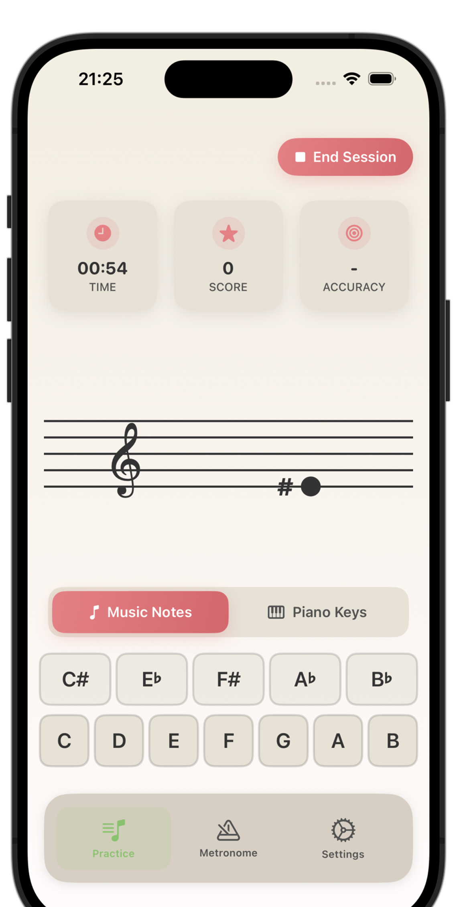

# Music Tutor

A simple iOS app for learning to read music notes.

## Features

- **Practice Mode** - Learn notes on Treble, Bass, and Alto clefs with letter buttons or piano keyboard input
- **Metronome** - Tempo control (40-240 BPM), time signatures, beat visualization
- **Learn** - Reference screens for each clef

## Requirements

iOS 15+

## Tech Stack

SwiftUI, AVFoundation
